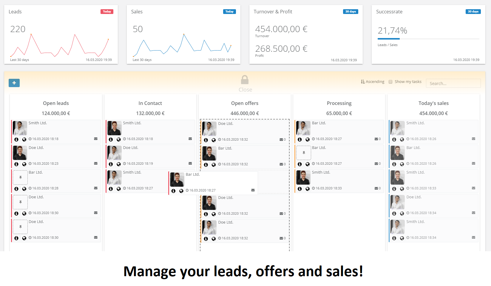
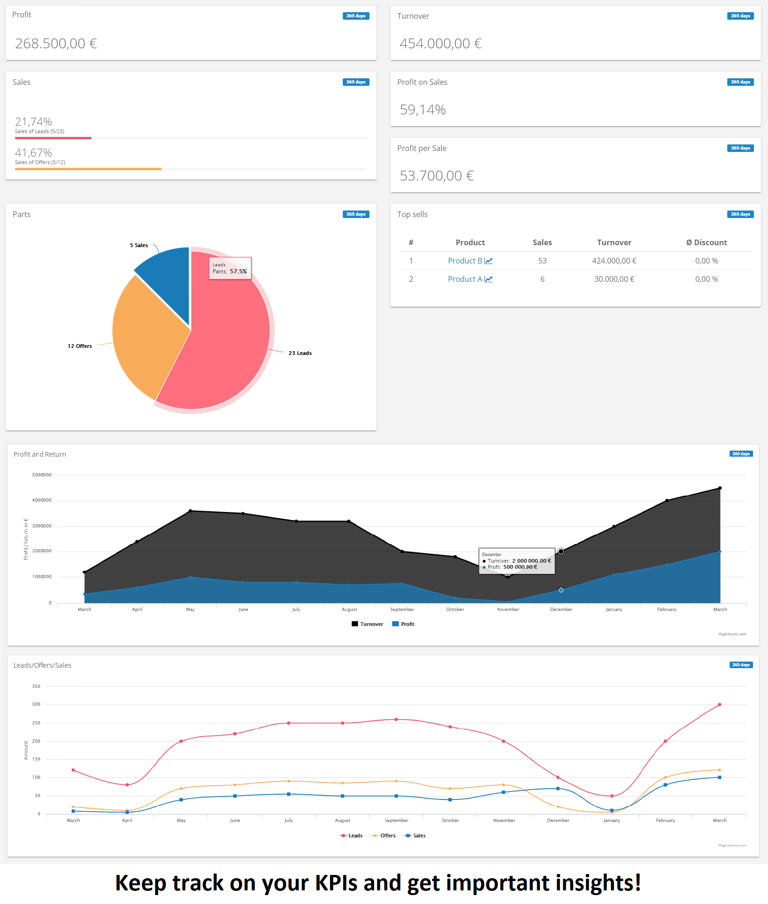
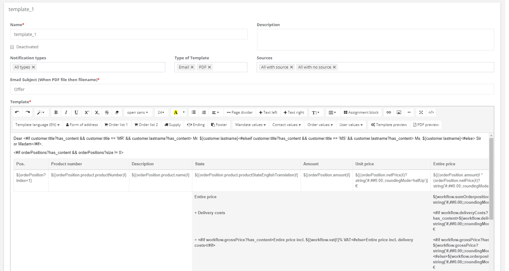
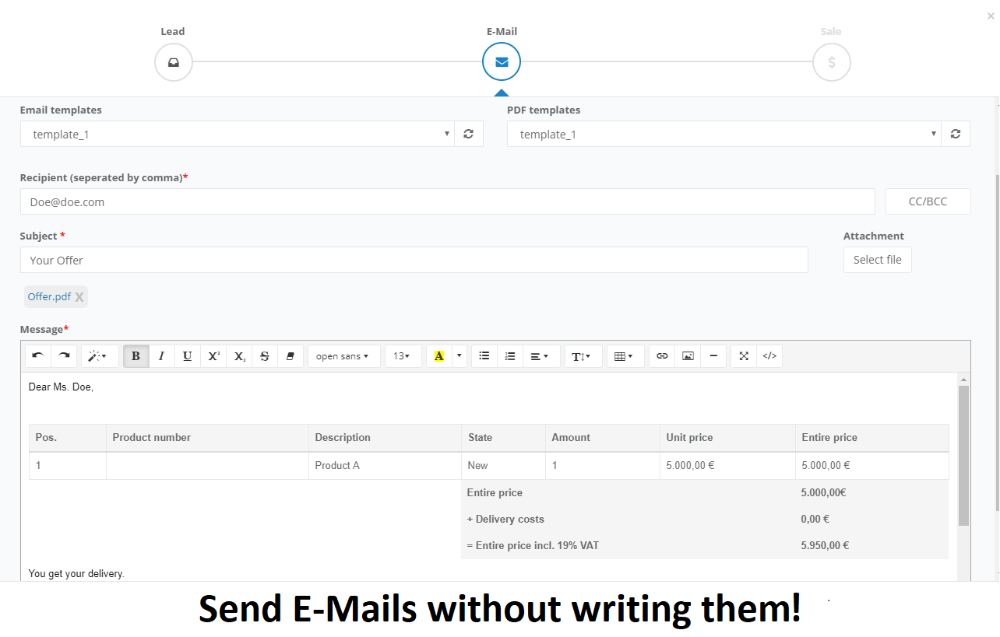

# LeadPlus+ a Lead Management System

This repository contains a software-as-a-service application for managing your leads, offers and sales by yourself or your team. 
The goal of **LeadPlus** is to support your work with **intelligent functions**, to **automate processes** in dealing with your leads and to **get important performance indicators** from your business in order to **maximize your sales**.

</img> </img>
</img> </img>

## More Features

* Track your own **Tasks** (Assigned leads, offers and sales)
* See all leads, offers and sales organized in an **easy datatable**
* Make **comments** to share information with your team
* **More statistics** like Profit, turnover, leads, offers and sales over a specific time (week, month, year)
* User statistics
* Product statistics 
* **Manage your products** you want to sell
* **Manage your clients** and see the history with them
* Add **apis** for getting leads from external pages (e.g. marketplace) directly in your system
* Manage your own **profile** (picture, phone, skype, ...)

## 0. Requirements

We use [Spring Boot 1.5.0](https://spring.io/projects/spring-boot) for our server and [AngularJS 1.6.1](https://angularjs.org/) for our frontend. 

It works with the following setup

* Java 8
* PostgreSQL 9.6
* npm 5.0.3
* Gradle 3.2.1

-> of course you can try newer versions.

## 1. Installation

### 1.1 Prepare your environment
Prepare your environment and setup the requirements [Java](https://www.java.com/de/download/), [postgreSQL](https://www.postgresql.org/), [npm](https://nodejs.org/en/download/) and [gradle](https://gradle.org/install/) on your machine.
 
 
**Don't forget to create a database in postgreSQL!** 

### 1.2 Replace passwords, security keys and database name

Search in your project for \_\_PLACEHOLDER\_\_ and you will find all replacable passwords, keys and database names. To run it on your local machine you have to change these keys:

File |      Description     
-------------- | ------------ 
application-local.properties | spring.datasource.platform=postgresql spring.datasource.url=jdbc:postgresql://localhost:5432/\_\_PLACEHOLDER\_\_  spring.datasource.username=postgres spring.datasource.password=\_\_PLACEHOLDER\_\_
build.gradle | flyway{   url = "jdbc:postgresql://localhost:5432/\_\_PLACEHOLDER\_\_"   user = "postgres"   password = "\_\_PLACEHOLDER\_\_" }

The other keys are not neccesary for a local environment but **you should set the keys for security reasons!** If you are **not on AWS** you can remove the aws keys. In the `application-xxx.properties` files you can also change some configuration stuff e.g. database user, flyway settings, jwt settings, ...

Make sure that in `application.properties` the profile is set to local:

> spring.profiles.active=local

### 1.3 Build your project

As buildmanager we use gulp and gradle and as packagemanager npm. At first run npm in the `root` directory to install frontend dependencies:

> npm install

it will install the node_modules. After that run gulp in the `root` directory to compile typescript:

> gulp

it will compile typscript and build the frontend in `/src/main/resources/static`.
Now you can run gradle in the `root` directory to build the whole project:

> gradle build

it will generate the `build` directory and a zip file `leadplus-3.4.3.6.zip` within the build directory. 

### 1.4 Start your application

Extract `leadplus-3.4.3.6.zip` to your server or to any place on your local machine and run the jar file:

> java -jar leadplus-3.4.3.6.jar 

now your server is online and you can access the webpage **demo.leadplus.localhost:8080** with the credentials: 

username: superadmin@demo.com 
password: demodemo 
 
or  
 
username: user@demo.com 
password: demodemo 
## 2. Create your own tenant/subdomain

1. To create your own tenant start your server and visit **http://leadplus.localhost:8080/registration** 
2. Fill in the form and you have access to **http://yourtenant.leadplus.localhost:8080**. 
3. Now you can start to track your leads, offers and sales
4. Enjoy!

## 3. Advanced Setup
### 3.1 HTTPS local
If you want to test your application locally by HTTPS just uncomment these lines in `application-local.properties`:

> #server.ssl.key-store: keystore.p12 
> #server.ssl.key-store-password: test12 
> #server.ssl.key-password = test12 
> #server.ssl.keyStoreType: PKCS12 
> #server.ssl.keyAlias: keystore 

and include `keystore.p12` in your build process. 

**NOTE: Check your application for http references and change to https!**

### 3.2 API
If you want to use the api for getting leads from an external page or something else you have to:
1. Create a source on your page http://yourtenant.leadplus.localhost:8080/#/settings/source 
2. Press the button on the right to get an Access-Token
3. This Access-Token grants you the permission to post leads via the rest api http://yourtenant.leadplus.localhost:8080/api/rest/public/lead

For more information check out the swagger-ui: http://yourtenant.leadplus.localhost:8080/swagger-ui.html. 

### 3.3 Nginx
If you want to deploy the application on a webserver with nginx then you have to configure the nginx files in `/elb_config/.ebextensions/`. The example file is configured for AWS. 

### 3.4 AWS
To deploy to AWS you need to set up your environment, configure nginx, set AWS keys, and deploy the zip file `leadplus-3.4.3.6.zip`. Make sure you change the profile in `application.properties`:

> spring.profiles.active=yourProfileYouWantToUse

## 4. License
You may need to purchase a [Highcharts license](https://www.highcharts.com/) for **commercial** use.

